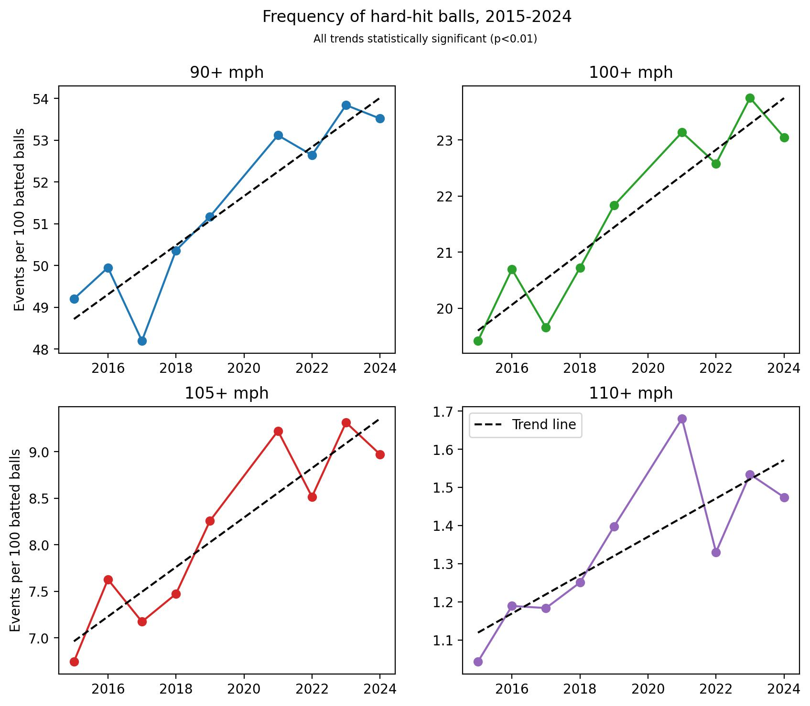
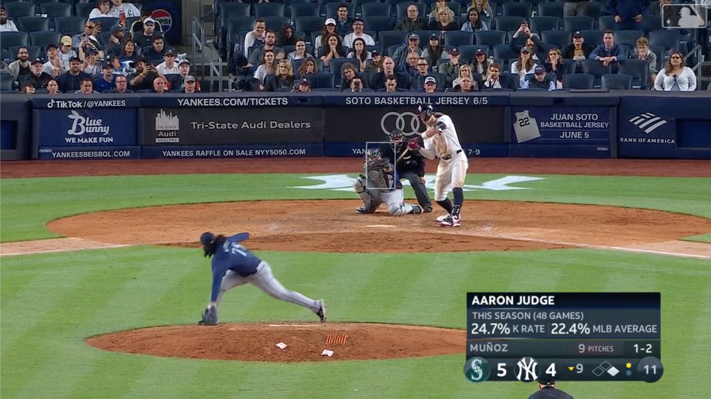
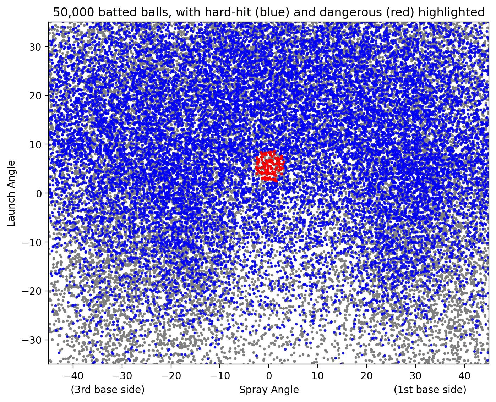
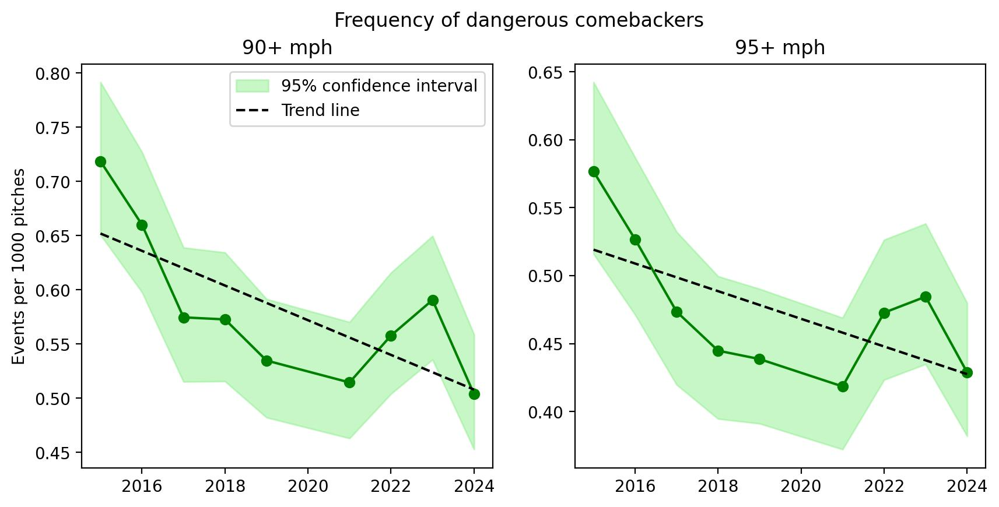
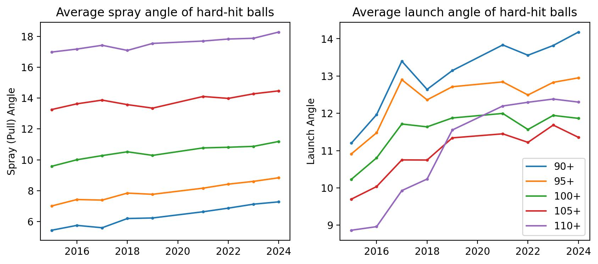

# The Launch Angle Revolution May Save Lives

Hitters today focus on hitting the ball hard, and putting it in the air. Those who succeed [become stars](https://baseballsavant.mlb.com/savant-player/kyle-schwarber-656941?stats=statcast-r-hitting-mlb). Those who fail are toiling away in the low minors attempting to reinvent themselves as knuckleballers while under league investigation for illegal gambling (at least, [some of them are](https://www.washingtonpost.com/sports/2024/06/10/david-fletcher-angels-pitcher-betting/)). Though this launch-angle revolution has hurt many pitchers' stat lines, there is one small, counter-intuitive, and yet potentially much more important reason for rejoice: a decline in comebackers.

It's not news to anyone that being on the recieving end of a 100 mph fastball is an unpleasant experience, but it's easy for players and fans alike forget that this little projectile is in fact [a deadly weapon](https://www.baseballprospectus.com/news/article/20914/pebble-hunting-how-beanballs-and-brawls-could-be-avoided/). While the tragic death of Ray Chapman, along with decades of bruises and broken bones, have spurred hitters to don an array of protective items in the box, the relative infrequency of hard-hit line drives at the pitcher has afforded them no such protections. This is despite the fact that batted balls regularly exceed the speeds of the fastest fastballs, and occassionally top 120 mph, which may approach the [limits of human reaction times](https://projects.seattletimes.com/2017/mariners-preview/science/) at that distance. Further, while hitters are selected for their [superhuman eyesight and reaction](https://pubmed.ncbi.nlm.nih.gov/9037989/), pitchers generally are not so endowed. Given the emphasis on exit velocity in modern hitting analytics, I feared that dangerous comebackers may be on the rise: 

That's a concerning chart. In particular, notice the difference in scales across the panels; while the frequency of 90+ mph batted balls has increased by 8.7% in this span, 110+ mph balls occur a full 41% more often now than they did in 2015! Let's find out if this trend is putting our already-fragile pitchers at even more risk.

### Counting Black Swans
The study of comebacker injuries is greatly complicated by the miniscule sample size of such events. Although [Sports Info Solutions tracks pitcher comebacker events](https://www.sportsinfosolutions.com/2023/05/18/stat-of-the-week-pitcher-injuries-on-comebackers-on-the-rise/), only around 10 per year result in even a trainer's visit to the mound. Impacts to the head even rarer but most concerning, where a few inches can make the difference between Bobby Miller, [relatively unphased](https://www.mlb.com/news/dodgers-bobby-miller-talks-line-drive-head-injury) after a glancing 105 mph blow to forehead, and Brandon McCarthy, who [barely survived](https://www.espn.com/mlb/story/_/id/8350276/brandon-mccarthy-oakland-athletics-life-threatening-situation) a line drive to the temple in 2012.

I tackled this problem instead by looking at the much larger sample of batted balls which had the _potential_ to seriously impact a pitcher. If the rate of these "dangerous" batted balls has changed, we can assume the risk of actual injuries has changed by a proportional amount, even if our observations of actual injuries are too small to analyze. First we need a definition of "dangerous" batted balls: It's not perfect, but I settled on all line-drives which pass within three feet of the average pitcher's chest at followthrough. Instead of actually measuring the location of the pitcher's chest--likely impossible with publicly available data--I opted to approximate the average pitcher's followthough as the point 55.5 feet from home plate and 4.4 feet above the ground. The former is roughly an average stride length away from the pitcher's rubber, while I estimated latter by pretending to throw a few pitches in my living room, measuring the position of my chest as a fraction of my standing height, and applying that to major league pitchers' average height (plus 5 inches for the height of the mound at that point). The three foot buffer is to account for pitchers who veer away from this point after release, such as Andrés Muñoz:

That's not exactly the athletic fielding position I would choose to put myself in if I had to a dodge line drives off the bat of Aaron Judge, but that's the price you pay for being able to paint 101 mph on the black.

With a bit of basic trigonometry, we can cross reference this definition with the launch angle, spray angle, and exit velocity of every batted ball in the Statcast era to determine which were potentially dangerous. The plot below shows--from the batter's perspective--the most recent 50,000 batted balls in MLB, with 95+ mph exit velocities colored blue, and 95+ mph "dangerous comebackers" colored red.

The danger zone is a small but not insignificant portion of the batter's field of view, and recieves a fair share of hard hit balls. The sweetspot is roughly a 5.5° launch angle to straightaway centerfield, which about right intuititively. Let's look at a few examples to ensure our definition is working as expected:

[Giancarlo Stanton, August 2nd 2018: 119.1 mph, 7° launch, -0.1° spray, 1.4 estimated feet from the average pitcher's chest](https://baseballsavant.mlb.com/sporty-videos?playId=31df2afb-0152-42a6-8d7b-fcdcb500b788)

Pretty good! A taller pitcher could have been in danger from that one.

[Vlad Guerrero Jr., August 31st 2022: 118.4 mph, 4° launch, -0.9° spray, 1.8 estimated feet from the average pitcher's chest](https://baseballsavant.mlb.com/sporty-videos?playId=14b9680c-86ab-4db2-a2c5-fed729c1e2e2)

Decent. I'd guess the spray angle was a little wider than statcast's estimate, but it's still close enough that it could have hit a left-handed Andrés Muñoz.

[Ketel Marte, April 2nd 2025: 115.5 mph, 4° launch, -0.8° spray, 1.7 estimated feet from the average pitcher's chest](https://baseballsavant.mlb.com/sporty-videos?playId=6c5ba8d3-2966-393f-bab8-14a4ebf95be2)

That one nearly nails Carlos Rodon in the hip, but he gets just a bit of glove on it. Excellent.

### Danger Over Time

When we apply this definition to roughly one million batted balls tracked since 2015 (ignoring 2020 as usual), we get a few thousand characterized as dangerous; the exact number depends on what exit velocity threshold is used. We'll look at 90+ and 95+ mph today, since for higher thresholds the samples become too small (we're already slicing the data pretty finely by launch and spray angle). When we plotted over time, we find a suprising trend: the rate of dangerous comebackers has decreased by 25-30% since 2015!

Both trends have fairly strong statistical significance (p=0.02 and 0.06 respectively) and a similar pattern overall: a large decrease in 2015-2017, and a more mixed signal since then. If the rate of dangerous comebackers was determined mostly by the rate of hard-hit balls, we'd expect it to look more like the first figure in this piece, with a fairly consistent positive trend across time. Instead, we're seeing both a different direction and shape.

Since this trend doesn't seem to be explained by exit velocity, let's look at our other two parameters, launch and spray angle. Below are the average launch and spray for all hard hit balls (not just dangerous comebackers), with spray angle normalized for batter handedness so that pulled balls are indicated by spray greater than zero:

Recall that the "sweetspot" of our danger zone was a launch of 5.5° and spray of 0°. This data shows that hard-hit balls, by any exit velocity definition, are on average being hit increasingly far from this danger zone both horizontally and vertically (all trends statistically significant with p<0.03). The largest change in launch angles occurred primarily during the 2015-2017 heyday of the aptly-named launch angle revolution, which explains the substantial decline in comebacker risk we found during that period. The increasing pull tendency over time illustrated in the spray angle shows a slower yet steadier increase. The vertical seperation between the lines underscores one of the driving factors behind the launch angle revolution: lifting and pulling the ball means meeting it out front, [which allows for faster swings and exit velocities](https://blogs.fangraphs.com/maybe-the-launch-angle-revolution-wasnt-really-about-launch-angle/). As a side-effect, this tendency may also help shield pitchers from the most exceptionally dangerous comebackers.

This data indicates pretty clearly that the lift-and-pull approach of modern hitting has contributed to a substantial reduction in the risk of potentially deadly line drives. With this context, giving up a couple extra cheap homers down the line to Isaac Paredes seems like a small price to pay. 

One missing piece of this analysis is a deeper understanding of the relationship between comebacker velocity and risk. At the low end, a 50 mph comebacker is about as dangerous as a 60 mph comebacker (not at all). At the high end however, I suspect risk increases exponentially, though to what degree I'm not sure. Is is 10% harder to avoid a 120 mph than 100 mph? Twice as hard? Ten times? Any of those could sound plausible to me.

### The Shape of Comebackers to Come

While the data paints a positive picture of the trend in comebacker risk, the issue is by no means alleviated. Regardless of how rare it might be, it will only take one deadly line drive to prompt a day of reckoning in the sport. Sadly, this reactive approach to safety is standard operating procedure for baseball; it was only well after Ray Chapman's death that batting helmets were mandated, and it similarly took the 2007 death of minor league first base coach Mike Coolbaugh for MLB to require helmets for base coaches as well. 

While a few pitchers have [used protective hats](https://www.nytimes.com/2014/07/23/sports/baseball/alex-torres-is-alone-in-mlb-wearing-isoblox-hat.html), their percieved uncoolness has been the primary roadblock to wider adoption. However, history provides some optimism on this front; the arc of baseball is long, but it does bend toward safety. While there was a time when catcher's gear was [considered unmanly and possibly unsporting](https://sabr.org/journal/article/the-evolution-of-catchers-equipment/), today [catchers](https://sports.yahoo.com/article/mariners-star-unveils-special-gear-013201568.html), [batters](https://www.reddit.com/r/baseball/comments/1bqxglj/bryce_harpers_shin_guard_today_is_fantastic/), and even [umpires](https://pbs.twimg.com/media/Go65YLhbIAAap7W?format=jpg&name=small) wear an array of personalized body armors which show off individual style, flair, and personality.

***

[TODO] code is available